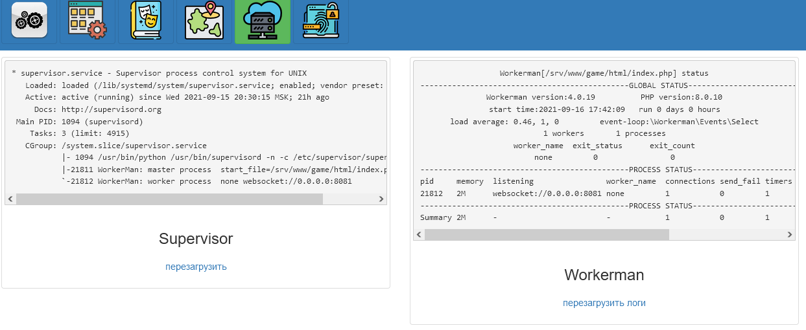

Сервер для клиент-серверного взаимодействия проекта [Онлайн игры](https://github.com/webrobot1?tab=repositories&q=%D0%9E%D0%BD%D0%BB%D0%B0%D0%B9%D0%BD&type=&language=&sort=). Работает как демон, выступает в виде роутера принимающий соединения при наличии токена (токен геренируется и првоеряется в приложении [Онлайн игры - Управление Миром](https://github.com/webrobot1/app-game) ), в работе используется проект Workerman ([git](https://github.com/walkor/Workerman)).    
    
Представлен в виде сервиса, использует библиотеку Workerman что предоставляет асинхронный Udp / Tcp / Websocket сервер , в качестве шины для взаимодейстия между другими сервис - приложениями используется Redis с Cli (те вызов других сервисов через командную строку сервера методами exec, что позволяет менять их в то время когда сервер работает)
    
Возможно использовать взамен Cli RabbitMQ (тем более что в PHP вызов exec относительно медленный) если сервисы приложения (типа движения, расчеты физики и тп) необходимо размещать на других серверах (все приложения в днный момент поддерживают это)    

Увеличение скорости достигается за счет:

	Используется Redis для хранения данных и обмена между приложениями Pub/Sub  (те сервер не жде ответа от них, но слушает Redis)
	Использование сокеты в Redis (разумеется если он на одном сервере с приложениями)
	Сохранение из Redis в СУБД осуществляется по таймеру (те раз в минуту) в асинхронном режиме (те без участия клиента)
	Использование сокеты в для работы с СУБД (те не 127.0.0.1 а localhost в качестве хоста)
	Использование API через Cli взаимодействи (могу ошибаться но тот же RabbitMQ работает на HTTP)
	
В настоящий момент скорость ответа сервера составляети 0.05 секунд без нагрузки. Полагаю данный показатель можно улучшить перейдя на Nginx 	, использовать Memcached (минимум в той части когда по токену загружаем данные игрока).

Имеется приложение на [Unity](https://github.com/webrobot1/unity) что работает с сервером по Api (поддерживает сразу все протоколоы работы с сервером, который меняется и в клиенте и на сервере при изменении константы PROTOCOL в фаиле model/ServerModel.php), так же имеется поддержка браузерных игр по технологии WebGl ([пример](http://95.216.204.181:8080/data/game/index.html) по протоколу взаимодействия WebSocket
	